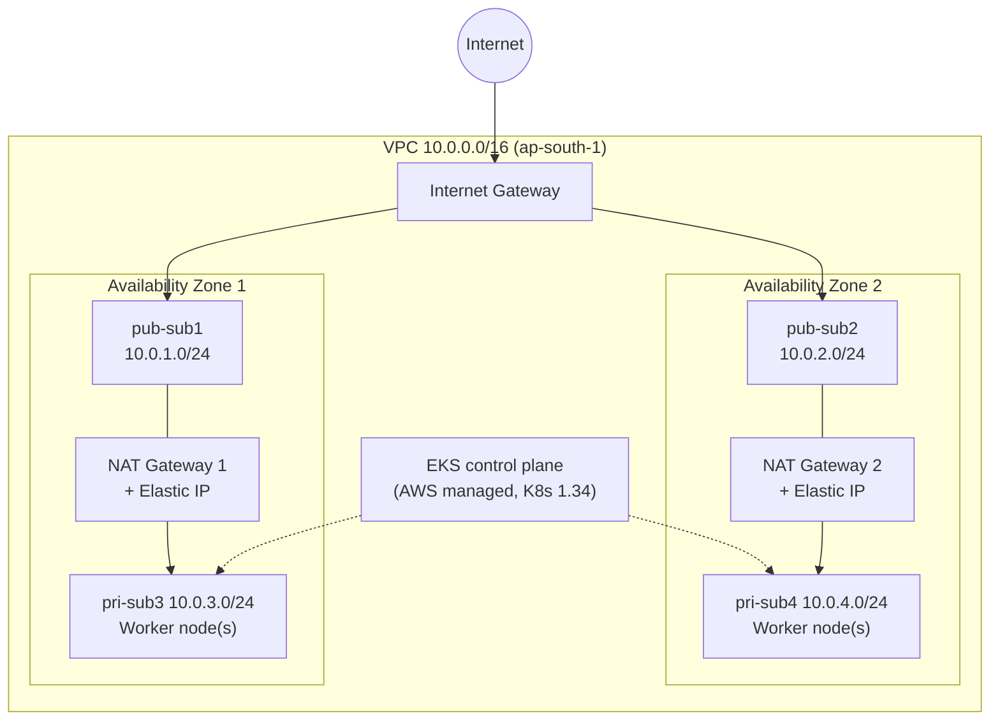

# kube_terraform: Amazon EKS on AWS with Terraform and Argo CD

Infrastructure-as-code for a production-style **Amazon EKS** cluster, written in modular Terraform and set up to deliver a ToDo application through **GitOps with Argo CD**.

Terraform builds the network (VPC, subnets, NAT gateways), the IAM roles, the EKS control plane and a managed worker node group. Once the cluster is up, Argo CD watches a separate manifest repository and keeps the cluster in sync with it.

---

## Table of contents

1. [Architecture](#architecture)
2. [What gets created](#what-gets-created)
3. [Repository layout](#repository-layout)
4. [Module reference](#module-reference)
5. [Prerequisites](#prerequisites)
6. [Configuration](#configuration)
7. [Deployment guide](#deployment-guide)
8. [GitOps with Argo CD](#gitops-with-argo-cd)
9. [Verifying the cluster](#verifying-the-cluster)
10. [Cleaning up](#cleaning-up)
11. [Design notes and known trade-offs](#design-notes-and-known-trade-offs)
12. [Troubleshooting](#troubleshooting)

---

## Architecture



Each private subnet sends its outbound traffic through the NAT gateway in its own Availability Zone, so losing one AZ does not take out egress for the other.

## What gets created

| Layer | Resources |
|---|---|
| **Network** | 1 VPC, 1 Internet Gateway, 2 public subnets, 2 private subnets (across 2 AZs), 1 public route table |
| **Egress** | 2 Elastic IPs, 2 NAT gateways (one per AZ), 2 private route tables |
| **IAM** | EKS cluster role and worker node role, with AWS managed policies attached |
| **Control plane** | 1 EKS cluster (Kubernetes **1.34**), VPC CNI add-on with prefix delegation |
| **Compute** | Launch template and a managed node group of **t3.micro** on-demand instances (min 2, desired 3, max 4) in the private subnets |
| **GitOps** | An Argo CD `Application` manifest (`argo-manifest.yaml`) that you apply after the cluster exists |

## Repository layout

```
kube_terraform/
├── ToDo-App/                  # Root module: the entry point you run Terraform from
│   ├── main.tf                # Wires all child modules together
│   ├── variables.tf           # Input variable declarations
│   ├── terraform.tfvars       # Concrete values (region, CIDRs, project name)
│   ├── provider.tf            # AWS provider and version constraint
│   ├── backend.tf             # Remote state in S3
│   └── argo-manifest.yaml     # Argo CD Application definition
└── modules/
    ├── vpc/                   # VPC, IGW, subnets, public routing
    ├── Nat-GW/                # Elastic IPs, NAT gateways, private routing
    ├── IAM/                   # Cluster and node group roles
    ├── EKS/                   # EKS cluster and VPC CNI add-on
    └── NodeGroup/             # Launch template and managed node group
```

## Module reference

### `modules/vpc`
Creates the network foundation.

- VPC with DNS support and DNS hostnames enabled (required by EKS).
- Internet Gateway attached to the VPC.
- Two **public** subnets (`pub-sub1`, `pub-sub2`) in the first two Availability Zones of the region, with `map_public_ip_on_launch = true`, associated to a public route table with a default route to the IGW.
- Two **private** subnets (`pri-sub3`, `pri-sub4`) in the same two AZs, without public IPs.
- Subnet tags that Kubernetes needs for load balancer discovery:
  - public: `kubernetes.io/role/elb = 1`
  - private: `kubernetes.io/role/internal-elb = 1`
  - all: `kubernetes.io/cluster/<PROJECT_NAME> = shared`

**Outputs:** `VPC_ID`, `PUB_SUB1_ID`, `PUB_SUB2_ID`, `PRI_SUB3_ID`, `PRI_SUB4_ID`, `IGW_ID`, `REGION`

### `modules/Nat-GW`
Gives private subnets outbound internet access (image pulls, package downloads, AWS API calls).

- One Elastic IP and one NAT gateway in each public subnet.
- A private route table per AZ (`pri-rt-a`, `pri-rt-b`), each with a `0.0.0.0/0` route to the NAT gateway in the same AZ, associated to `pri-sub3` and `pri-sub4` respectively.

### `modules/IAM`
Creates two roles.

| Role | Trusted service | Attached managed policies |
|---|---|---|
| `<PROJECT_NAME>-EKS-role` | `eks.amazonaws.com` | `AmazonEKSClusterPolicy`, `ElasticLoadBalancingFullAccess` |
| `<PROJECT_NAME>-node_group-role` | `ec2.amazonaws.com` | `AmazonEKSWorkerNodePolicy`, `AmazonEKS_CNI_Policy`, `AmazonEC2ContainerRegistryReadOnly` |

**Outputs:** `EKS_CLUSTER_ROLE_ARN`, `NODE_GROUP_ROLE_ARN`

### `modules/EKS`
- `aws_eks_cluster` named after `PROJECT_NAME`, running Kubernetes **1.34**, spanning all four subnets.
- API endpoint is reachable both **publicly** and **privately**.
- `aws_eks_addon` for **vpc-cni** with `ENABLE_PREFIX_DELEGATION=true` and `WARM_PREFIX_TARGET=1`. Prefix delegation lets small instances such as `t3.micro` host far more pod IPs than the default ENI limits allow.

**Outputs:** `EKS_CLUSTER_NAME`, `EKS_CLUSTER_ENDPOINT`, `EKS_CLUSTER_CA`, `EKS_CLUSTER_CIDR`

### `modules/NodeGroup`
- Looks up the recommended **Amazon Linux 2023** EKS-optimized AMI for 1.34 from the public SSM parameter, so nodes always match the cluster version.
- Launch template: `t3.micro`, 20 GB `gp3` root volume, and `nodeadm` `NodeConfig` user data that joins the node to the cluster and sets kubelet `--max-pods=110`.
- Managed node group in the **private** subnets: `ON_DEMAND`, min **2** / desired **3** / max **4**.

## Prerequisites

| Tool | Notes |
|---|---|
| [Terraform](https://developer.hashicorp.com/terraform/install) **>= 1.10** | The S3 backend uses `use_lockfile`, which needs 1.10 or newer |
| [AWS CLI v2](https://docs.aws.amazon.com/cli/latest/userguide/getting-started-install.html) | Configured with `aws configure` or SSO |
| [kubectl](https://kubernetes.io/docs/tasks/tools/) | To talk to the cluster |
| An AWS account | The identity you use needs permission to create VPC, EC2, EKS, IAM and S3 resources |
| An **S3 bucket** for Terraform state | Must exist before `terraform init` (see below) |

> The resources in this repo bill hourly (EKS control plane, NAT gateways, EC2 nodes, Elastic IPs). Destroy the stack when you are done experimenting.

## Configuration

### 1. Remote state: `ToDo-App/backend.tf`

```hcl
terraform {
  backend "s3" {
    bucket       = "eks-terra-bucket123"
    key          = "backend/ToDo-App.tfstate"
    region       = "ap-south-1"
    use_lockfile = true
  }
}
```

S3 bucket names are globally unique. **Replace `eks-terra-bucket123` with your own bucket**, and create it first:

```bash
aws s3api create-bucket \
  --bucket <your-unique-bucket-name> \
  --region ap-south-1 \
  --create-bucket-configuration LocationConstraint=ap-south-1

# Recommended: keep old state versions
aws s3api put-bucket-versioning \
  --bucket <your-unique-bucket-name> \
  --versioning-configuration Status=Enabled
```

`use_lockfile = true` uses S3-native state locking, so no DynamoDB table is required.

### 2. Input values: `ToDo-App/terraform.tfvars`

| Variable | Default | Description |
|---|---|---|
| `REGION` | `ap-south-1` | AWS region |
| `PROJECT_NAME` | `ToDo-App` | Prefix for resource names and the **EKS cluster name** |
| `VPC_CIDR` | `10.0.0.0/16` | CIDR block of the VPC |
| `PUB_SUB1_CIDR` | `10.0.1.0/24` | Public subnet in AZ 1 |
| `PUB_SUB2_CIDR` | `10.0.2.0/24` | Public subnet in AZ 2 |
| `PRI_SUB3_CIDR` | `10.0.3.0/24` | Private subnet in AZ 1 |
| `PRI_SUB4_CIDR` | `10.0.4.0/24` | Private subnet in AZ 2 |

An alternative `192.168.0.0/16` addressing plan is included as comments in the file. The four subnet CIDRs must sit inside `VPC_CIDR` and must not overlap.

> The region is also hardcoded in `provider.tf` (`ap-south-1`). If you change `REGION`, change it there and in `backend.tf` too.

## Deployment guide

```bash
# 1. Clone
git clone https://github.com/pavitrajena14/kube_terraform.git
cd kube_terraform/ToDo-App

# 2. Confirm which AWS identity you are using
aws sts get-caller-identity

# 3. Initialise providers, modules and the S3 backend
terraform init

# 4. Review what will be created
terraform plan

# 5. Create everything (typically 15 to 20 minutes, mostly the EKS control plane)
terraform apply
```

Then connect `kubectl` to the new cluster:

```bash
aws eks update-kubeconfig --region ap-south-1 --name ToDo-App
kubectl get nodes
```

The cluster name is the value of `PROJECT_NAME`.

## GitOps with Argo CD

The cluster is intended to be managed declaratively: application manifests live in a **separate Git repository**, and Argo CD applies them.

### 1. Install Argo CD

```bash
kubectl create namespace argocd
kubectl apply -n argocd \
  -f https://raw.githubusercontent.com/argoproj/argo-cd/stable/manifests/install.yaml
kubectl -n argocd rollout status deploy/argocd-server
```

### 2. Register the application

```bash
kubectl apply -f argo-manifest.yaml
```

What `argo-manifest.yaml` configures:

| Field | Value | Meaning |
|---|---|---|
| `metadata.name` | `todo-app-argo` | Name of the Argo CD application |
| `source.repoURL` | `https://github.com/pavitrajena14/kube_manifest.git` | Repo holding the Kubernetes manifests |
| `source.targetRevision` | `main` | Branch to track |
| `source.path` | `manifest` | Folder inside the repo to deploy |
| `destination.namespace` | `myapp` | Target namespace |
| `syncPolicy.automated.prune` | `true` | Delete resources that were removed from Git |
| `syncPolicy.automated.selfHeal` | `true` | Revert manual changes made in the cluster |
| `syncOptions` | `CreateNamespace=true` | Create `myapp` if missing |

With automated sync, a `git push` to the manifest repo is all it takes to roll out a change.

### 3. Open the Argo CD UI

```bash
# Initial admin password
kubectl -n argocd get secret argocd-initial-admin-secret \
  -o jsonpath="{.data.password}" | base64 -d; echo

# Local access at https://localhost:8080 (user: admin)
kubectl -n argocd port-forward svc/argocd-server 8080:443
```

## Verifying the cluster

```bash
kubectl get nodes -o wide          # 3 nodes in Ready state (private IPs)
kubectl get pods -A                # system pods and Argo CD running
kubectl -n argocd get applications # todo-app-argo should be Synced / Healthy
kubectl -n myapp get all           # the deployed application
```

To confirm prefix delegation is active on the CNI:

```bash
kubectl -n kube-system get ds aws-node \
  -o jsonpath='{.spec.template.spec.containers[0].env}' | tr ',' '\n' | grep -i prefix
```

## Cleaning up

Delete anything that created AWS resources outside Terraform **before** destroying, otherwise the VPC deletion can hang on leftover load balancers and network interfaces.

```bash
# Remove the app (and its Service of type LoadBalancer, if any)
kubectl delete -f argo-manifest.yaml
kubectl -n myapp get svc            # wait until no LoadBalancer services remain

# Tear down the infrastructure
cd kube_terraform/ToDo-App
terraform destroy
```

The state bucket is not managed by this code, so delete it manually if you no longer need it.

## Design notes and known trade-offs

These are deliberate simplifications for a learning or demo environment. Revisit them before using this for anything production-grade.

- **`t3.micro` nodes** are cheap but have 1 GiB of memory. Prefix delegation plus `--max-pods=110` removes the pod IP limit, but memory remains the real constraint. Move to `t3.medium` or larger for real workloads (edit `instance_type` in `modules/NodeGroup/main.tf`).
- **Public API endpoint** is enabled alongside the private one. For tighter security, set `endpoint_public_access = false` or restrict it with `public_access_cidrs`.
- **`ElasticLoadBalancingFullAccess`** on the cluster role is broad. The AWS Load Balancer Controller normally uses its own scoped IAM policy via IRSA or EKS Pod Identity.
- **Two NAT gateways** give AZ resilience but are the largest fixed cost after the control plane. A single NAT gateway is cheaper if you can accept the lower availability.
- **Hardcoded values:** Kubernetes version (`1.34`) appears in both `modules/EKS/main.tf` and the AMI SSM path in `modules/NodeGroup/main.tf`; the region appears in `provider.tf` and `backend.tf`. Keep them in sync when upgrading or moving regions.
- **`$Latest` launch template version** means node group changes pick up new template revisions automatically.
- **No variable validation or defaults** in the module `variables.tf` files. Everything is supplied from `terraform.tfvars`.

## Troubleshooting

| Symptom | Likely cause and fix |
|---|---|
| `Error: Failed to get existing workspaces` / bucket not found on `init` | The S3 bucket in `backend.tf` does not exist or belongs to someone else. Create your own and update the name. |
| `Unsupported argument "use_lockfile"` | Terraform is older than 1.10. Upgrade Terraform. |
| `Unauthorized` / `You must be logged in to the server` from `kubectl` | The IAM identity that ran `terraform apply` is the cluster creator. Run `aws eks update-kubeconfig` with the same identity, or add your user through an EKS access entry. |
| Nodes stay `NotReady` or never join | Check that NAT gateways and private route tables exist (nodes need egress to reach the EKS API and ECR) and that the node role has all three policies attached. |
| Pods stuck in `Pending` with "Too many pods" | Confirm the VPC CNI add-on applied prefix delegation (see [Verifying](#verifying-the-cluster)) and that nodes launched with the launch template. |
| `terraform destroy` hangs on subnets or the VPC | A Kubernetes `LoadBalancer` service or leftover ENIs still exist. Delete the workloads first, then retry. |
| Argo CD app shows `OutOfSync` or `Unknown` | Check that `kube_manifest` is reachable, the branch is `main`, and the `manifest/` folder exists. |

---

## Acknowledgements

The structure of this project follows a Medium blog series on provisioning EKS with Terraform; the original walkthrough links are preserved in the earlier version of this README.
